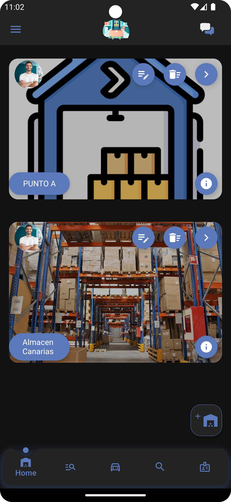
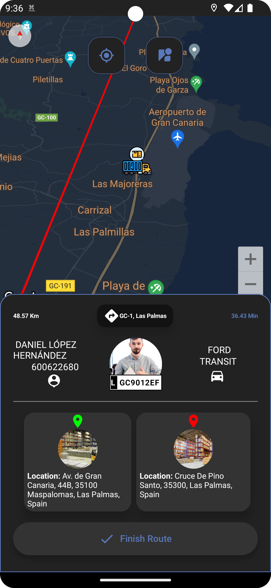

 # QRStockMate: Sistema de Gestión Logística Multiplataforma
<h1 align="center"></h1>


<p align="center"> 
  
 
 


</p>

<p>QRStockMate es un Sistema de gestión logística multiplataforma, que permite a las empresas controlar de forma eficiente y precisa sus inventarios, almacenes, empleados asociados, vehículos, rutas logísticas, gestiones de capacidad máxima y chat para comunicaciones además de implementar funciones basados en roles</p> 

Warehouse            |  Transportation Tracking
:-------------------------:|:-------------------------:
  |  

| Dashboard |
|:-:|
|  |


## Contenido
<div>

  <h3>1.Presentación</h3>
  <h3>2.Funciones</h3>
  <h3>3.Ejecución</h3>
  <h3>4.Tecnologías</h3>
 
</div>

## Presentación
En el entorno digital actual, las aplicaciones logísticas desempeñan un papel crucial en la eficiencia y sostenibilidad de las empresas. La digitalización, especialmente a través de plataformas web y móviles, no solo optimiza los procesos empresariales, sino que también contribuye significativamente al desarrollo sostenible. Al minimizar la necesidad de recursos físicos y optimizar las rutas de entrega, estas aplicaciones reducen la huella de carbono y promueven prácticas empresariales eco-amigables.

Este Trabajo Fin de Grado propone el desarrollo de una aplicación logística avanzada, diseñada tanto para web como para dispositivos móviles Android. El objetivo principal es crear un sistema de gestión integral que facilite las operaciones logísticas, mejorando la eficiencia, la precisión y la capacidad de respuesta de las empresas frente a las demandas del mercado.

## Funciones
El sistema QRStockMate tiene las siguientes funcionalidades entre otras:
##### Cliente Android 
<li>Registro de productos.</li>
<li>CRUD de almacenes, usuarios, productos, palets, vehículos y rutas.</li>
<li>Lectura de códigos QR, para registrar productos.</li>
<li>Entrada y salida de productos, palets y vehículos.</li>
<li>Historial de transacciones de toda actividad con exportación a medios externos como Excel.</li>
<li>Búsqueda y filtros.</li>
<li>Seguridad y Acceso Controlado, es decir uso de sistema de autenticación desarrollado en el backend, y acceso a funcionalidades según el rol.</li>
<li>Gestión de Almacenes Centralizada.</li>
<li>Gestión de vehículos en posesión por la empresa con lógica de carga máxima.</li>
<li>Gestión de rutas logísticas para transportar mercancía entre los almacenes.</li>
<li>Chat general para mandar comunicaciones.</li>
<li>Panel para usuarios con rol ‘Carrier, para ver las mercancías que tienen pendientes a entregar ese día y capacidad para crear rutas logísticas para transportarlas.</li>
<br>

Android Screen (not all)          |
:-------------------------:|
.png)  |  

##### Cliente Web 
<li>Uso exclusivo para rol “Director” y “Administrador”.</li>
<li>Implementación de funcionalidades RUD de la app, a excepción de 'Funcionalidad de creación de cuenta' 'Lector QR'</li>
<li>Módulo para importar items desde un excel</li>
<li>Exportación de datos a excel</li>
<li>Dashboard donde el usuario puede gestionar vistas de estadísticas sobre la actividad en la empresa (transportes en periodos de tiempo, actividad empleados, rutas, etc)</li>
<br>

 Web Tracking            |  App Tracking
:-------------------------:|:-------------------------:
  |  


#### API
<li>.NET Health check</li>
<li>Swagger Doc</li>
<li>.NET WebHooks</li>
<br>

Health check           |  WebHooks | Swagger
:-------------------------:|:-------------------------:|:-------------------------:
  |   |  


## Ejecución
Para ejecutar el proyecto, sigue los siguientes pasos:
### Aplicación Web:
1. Primero accede a QRStockMateWeb
2. Luego procede con las siguientes acciones:
 ```
 // descarga las dependencias
 npm i 

 //Crea un archivo en /QRStockMateWeb/src/environment/keys.ts, con el siguiente contenido:
 export const key = {
     MAP: "AQUI VA TU APIKEY PARA MAPTILTER"
 }

 // Ejecuta la aplicacion web
 ng serve -o 
 ```
### Aplicación Android:
1. Primero accede a QRStockMateApp
2. Luego procede con las siguientes acciones:
 ```
 //Modifica el archivo com/example/qrstockmateapp/api/services/RetrofitInstance.kt
 private const val BASE_URL = "https://TU_IP_AQUI:5221/api/v1/"

 //Crea un archivo en /QRStockMateApp/local.properties, con el siguiente contenido:
 MAPS_API_KEY="AQUI VA TU API PARA GOOGLE MAP DE GOOGLE CLOUD"
 ```

### Aplicación API:
1. Primero accede a QRStockMateSL
2. Luego procede con las siguientes acciones:
 ```
 //Modifica y pon tu ip en/QRStockMateSL/QRStockMate/Properties/launchSetting
"https": {
  "commandName": "Project",
  "dotnetRunMessages": true,
  "launchBrowser": true,
  "launchUrl": "swagger",
  "applicationUrl": "https://localhost:7220;https://TU_IP_AQUI:5221",
  "environmentVariables": {
    "ASPNETCORE_ENVIRONMENT": "Development"
  }
},

 //Crea un archivo en /QRStockMateSL/QRStockMate.AplicationCore/Entities/keySMPT.cs, con el siguiente contenido:
public static class Key {
		public static readonly string ApiKeyFirebase = "AQUI VA TU API DE FIREBASE";
		public static readonly string ApiKey= "AQUI VA TU CONTRASEÑA DE APLICACION DE UNA CUENTA GOOGLE PARA LA NOTIFICACION POR CORREO";
}

// Con SQLServer y  SSMS Instalado ejecuta los siguientes comando en Visual Studio

	//Si existe la carpeta Migrations
	Update-Database

	//Si no
	Add-Migration InitialCreate
	Update-Database
 ```
## Tecnologías Y Arquitecturas
### Backend
 - Arquitectura: Arquitectura Limpia
 - API: ASP.NET y Visual Studio (C#)
 - BD Relacional: SqlServer
 - BD No Relacional: Firebase Storage
 - Seguridad del Sistema: JsonWebToken
 - .NET Health check: HealthCheck UI
 - .NET WebHooks: HealthCheck UI - WebHooks
 - DOC: Swagger

Clean Arquitecture           |  App Arquitecture
:-------------------------:|:-------------------------:
  |  

### Frontend/Clientes
 - Aplicación Móvil: Android Studio (Kotlin, JetCompose, SDK), Google Map
 - Aplicación Web: Framework Angular (Typescript), Map Tilter, Gmail


## Objetivos Personales
Adquisición de experiencia en el establecimiento de criterios para la toma de decisiones en el ciclo de desarrollo completo de una aplicación software.
Desarrollo de un proyecto totalmente exportable a otras plataformas.
Mayor comprensión del ecosistema de Android Studio, Visual Studio y los Frameworks empleados.
Este README proporciona una visión general del proyecto QRStockMate, detallando su propósito, funcionalidades, tecnologías utilizadas y cómo ejecutarlo.
